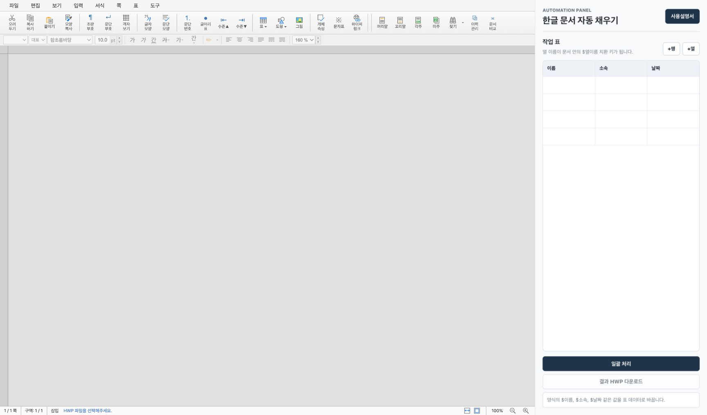

# 한글 문서 자동 채우기

HWP/HWPX 양식을 열고, 오른쪽 표에 입력한 여러 행의 데이터를 이용해 한글 문서를 일괄 생성하는 웹 기반 자동화 도구입니다.

예를 들어 양식 문서 안에 `$이름`, `$소속`, `$날짜` 같은 치환 키를 넣어두고 표의 열 이름을 `이름`, `소속`, `날짜`로 맞추면, 각 행의 값으로 문서를 복제하고 해당 문구를 자동으로 바꿉니다.

## 스크린샷



## 배포용 이미지

Vercel 배포와 메신저 공유를 위해 기본 브랜드 자산을 포함합니다.

- `public/logo.png`: ChatGPT 이미지 생성으로 만든 앱 로고
- `public/favicon-32.png`, `public/favicon-16.png`: 브라우저 탭 아이콘
- `public/apple-touch-icon.png`: 모바일 홈 화면 아이콘
- `public/icon-192.png`, `public/icon-512.png`: PWA/manifest 아이콘
- `public/og-image.png`: 카카오톡, Slack, 문자 공유 미리보기 이미지
- `public/site.webmanifest`: 앱 이름과 아이콘 메타데이터

자산을 다시 생성하려면 아래 명령을 실행합니다.

```bash
npm run generate:brand-assets
```

## 주요 기능

- 브라우저 안에서 rhwp 편집기를 좌측에 임베드합니다.
- 우측 사이드바의 표로 일괄 처리 데이터를 입력합니다.
- 표의 열 이름을 기준으로 `$열이름` 형식의 치환 키를 찾습니다.
- 행 단위로 원본 양식을 복제하고, 각 행의 값으로 치환합니다.
- 결과 문서를 다시 rhwp에 로드해 바로 확인할 수 있습니다.
- 생성된 결과를 HWP 파일로 다운로드할 수 있습니다.
- 원본 양식이 여러 페이지인 경우, 각 데이터 행마다 원본 페이지 수를 유지하도록 보정합니다.

## 화면 구성

- 좌측: rhwp 한글 문서 편집기
- 우측: 자동 채우기 사이드바
- 사용설명서: 기본 사용 흐름을 안내하는 모달
- 작업 표: 치환할 데이터 입력 영역
- 일괄 처리: 현재 문서와 표 데이터를 합쳐 결과 HWP 생성
- 결과 HWP 다운로드: 마지막 생성 결과를 파일로 저장

## 사용 방법

1. 좌측 rhwp 편집기에서 HWP 또는 HWPX 양식 파일을 엽니다.
2. 양식 문서 안에 `$이름`, `$소속`, `$날짜`처럼 치환 키를 넣어둡니다.
3. 오른쪽 작업 표의 열 이름을 치환 키 이름과 맞춥니다.
   - 열 이름이 `이름`이면 문서 안의 `$이름`을 찾습니다.
   - 열 이름이 `회사명`이면 문서 안의 `$회사명`을 찾습니다.
4. 각 행에 생성할 문서의 데이터를 입력합니다.
5. `일괄 처리` 버튼을 누릅니다.
6. 좌측 rhwp 편집기에 생성 결과가 다시 열리면 내용을 확인합니다.
7. 필요하면 `결과 HWP 다운로드` 버튼으로 파일을 저장합니다.

## 예시

양식 문서 내용:

```text
협약 기업명: $회사명
담당자: $이름
협약일: $날짜
```

작업 표:

| 회사명 | 이름 | 날짜 |
| --- | --- | --- |
| 가나다산업 | 김철수 | 2026-05-20 |
| 마바사테크 | 이영희 | 2026-05-21 |

처리 결과:

- 1번째 복사본: `$회사명`, `$이름`, `$날짜`가 `가나다산업`, `김철수`, `2026-05-20`으로 변경됩니다.
- 2번째 복사본: `$회사명`, `$이름`, `$날짜`가 `마바사테크`, `이영희`, `2026-05-21`로 변경됩니다.

## 처리 방식

이 앱은 `@rhwp/editor`와 `@rhwp/core`를 사용합니다.

- 편집기는 rhwp를 임베드해 HWP/HWPX 파일을 열고 표시합니다.
- 일괄 처리 시 현재 문서를 기준 양식으로 사용합니다.
- 표의 각 행을 하나의 데이터 레코드로 변환합니다.
- 양식을 레코드 수만큼 복제합니다.
- 각 복사본 안에서 `$열이름` 치환 키를 찾아 해당 행의 값으로 바꿉니다.
- 결과는 HWP 바이트로 생성됩니다.

복잡한 표 기반 HWP 문서에서는 단순 복사 후 내부 페이지 나눔이 접히는 경우가 있어, 원본 문단의 페이지 위치를 기준으로 복사본의 페이지 나눔을 복원합니다.

## 설치 및 실행

```bash
npm install
npm run dev
```

개발 서버가 실행되면 브라우저에서 아래 주소를 엽니다.

```text
http://127.0.0.1:5173/
```

## 빌드

```bash
npm run build
```

빌드 결과는 `dist/` 폴더에 생성됩니다.

## 테스트

기본 테스트:

```bash
npm test
```

브라우저 기반 E2E 테스트:

```bash
npm run test:browser-e2e
```

테스트는 다음을 확인합니다.

- 치환 키가 데이터 값으로 바뀌는지
- `$이름` 같은 원본 치환 키가 남지 않는지
- 2페이지 양식을 2건 처리했을 때 4페이지가 생성되는지
- HWP 검증 경고가 발생하지 않는지

## 현재 제약

- 웹 브라우저에서 처리 가능한 rhwp 기능 범위 안에서 동작합니다.
- 아주 복잡한 HWP 문서의 레이아웃은 원본 한컴오피스 렌더링과 완전히 같지 않을 수 있습니다.
- 현재 UI는 로컬 작업용 기본 버전이며, 사용자 계정/파일 저장소/작업 이력 관리는 포함하지 않습니다.
- 치환 키는 현재 `$열이름` 텍스트를 기준으로 동작합니다.

## 기술 스택

- Vite
- TypeScript
- `@rhwp/editor`
- `@rhwp/core`
- Playwright

## 프로젝트 구조

```text
.
├── src/
│   ├── main.ts       # 화면 구성, rhwp 편집기 연동, 일괄 처리 UI
│   ├── hwpMerge.ts   # HWP 양식 복제 및 치환
│   ├── hwpxMerge.ts  # HWPX 병합 실험/보조 로직
│   └── styles.css    # 레이아웃 및 UI 스타일
├── scripts/
│   ├── test-rhwp-e2e.ts
│   ├── test-browser-e2e.ts
│   └── test-hwpx-merge.ts
├── index.html
├── package.json
└── tsconfig.json
```

## 앞으로 확장할 기능

- 표 데이터 가져오기 및 내보내기
- CSV/Excel 업로드
- 치환 키 자동 탐지
- 처리 전 미리보기
- 결과 파일명 규칙 설정
- 여러 양식 템플릿 관리
- 작업 이력 및 오류 리포트
